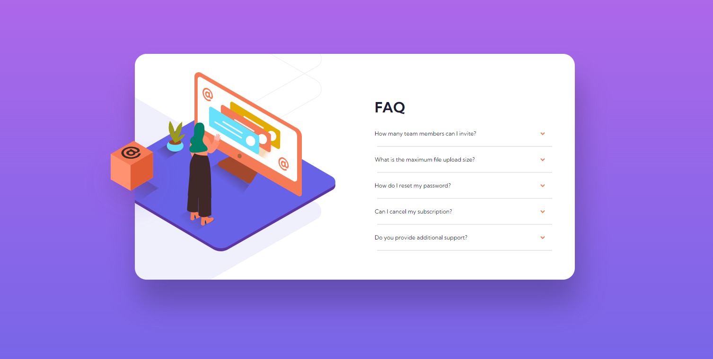

# Frontend Mentor - FAQ accordion card solution

This is a solution to the [FAQ accordion card challenge on Frontend Mentor](https://www.frontendmentor.io/challenges/faq-accordion-card-XlyjD0Oam). Frontend Mentor challenges help you improve your coding skills by building realistic projects. 

## Table of contents

- [Overview](#overview)
  - [The challenge](#the-challenge)
  - [Screenshot](#screenshot)
  - [Links](#links)
- [My process](#my-process)
  - [Built with](#built-with)
  - [What I learned](#what-i-learned)

- [Author](#author)

## Overview

### The challenge

Users should be able to:

- View the optimal layout for the component depending on their device's screen size
- See hover states for all interactive elements on the page
- Hide/Show the answer to a question when the question is clicked

### Screenshot

### Links

- Solution URL: [https://github.com/MachadoA/JS-newbie/tree/main/faq-accordion-card-main](https://github.com/MachadoA/JS-newbie/tree/main/faq-accordion-card-main)
- Live Site URL: [https://faq-accordion-card-newbie.netlify.app/](https://faq-accordion-card-newbie.netlify.app/)

## My process

### Built with

- Semantic HTML5 markup
- CSS custom properties
- Flexbox
- Mobile-first workflow

### What I learned

I've learned to work more with background images. This FAQ was productive and enjoyable.

## Author

- Website - [Add your name here](https://www.your-site.com)
- Frontend Mentor - [@MachadoA](https://www.frontendmentor.io/profile/MachadoA)

